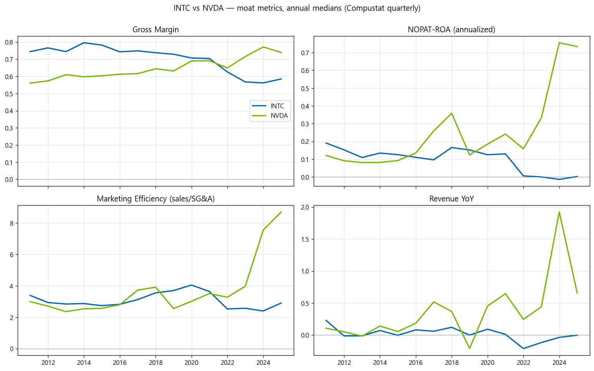

# Semiconductor Moat Analysis: NVIDIA (NVDA) vs. Intel (INTC)

Comparative fundamental analysis of economic moats in the semiconductor industry (GICS 453010),
tracing how the moat flipped from Intel to NVIDIA over 2011–2025.

---

## 📊 Results

*Generated by [`INTC_vs_NVDA_비교분석.ipynb`](INTC_vs_NVDA_비교분석.ipynb) — fully reproducible
from the committed CSV, no WRDS account needed.*

**Key findings (annual medians, Compustat quarterly):**

* **Gross-margin crossover (2022–2023)**: INTC held 74–80% through 2011–2015 but fell to 56–59%
  after 2022; NVDA traveled the exact opposite path, from 56% to 74–77% — pricing power migrated
  from the x86 monopoly to the AI-accelerator monopoly.
* **Capital efficiency**: annualized NOPAT-ROA collapsed for INTC (~19% → ~0% after 2022, foundry
  capex + shrinking revenue) while NVDA's exploded to ~75% by 2024–2025.
* **Operating leverage**: NVDA's sales-to-SG&A ratio rose from 3.0 to 8.7 — the classic
  "sells itself" moat signal. INTC retreated from 3.4 to 2.4.

An earlier Tableau visualization of the same dataset is kept as
`Semiconductor Moat Analysis (INTC vs NVDA).png`.

---

## 📂 Project Structure

| File | What it is |
|---|---|
| [`INTC_vs_NVDA_비교분석.ipynb`](INTC_vs_NVDA_비교분석.ipynb) | **Reproducible analysis** — reads the committed CSV, computes metrics, renders the chart above |
| [`Semiconductor_Moat_Analysis.ipynb`](Semiconductor_Moat_Analysis.ipynb) | Data-extraction pipeline (requires WRDS academic access) |
| `Moat_Analysis.csv` | 7,902 firm-quarters of semiconductor fundamentals + adjusted prices (2010–2025, 252 tickers) |
| `intc_vs_nvda_moat.png` | Chart generated by the comparison notebook |
| `Semiconductor Moat Analysis (INTC vs NVDA).png` | Earlier Tableau export |

## Metric definitions

| Metric | Formula | Moat interpretation |
|---|---|---|
| Gross Margin | (revtq − cogsq) / revtq | Pricing power defends margin against input costs |
| NOPAT-ROA | oiadpq × (1 − effective tax) / atq | After-tax operating return on assets |
| Marketing Efficiency | saleq / xsgaq | Moat firms sell without proportional SG&A |
| Revenue YoY | revtq vs. 4 quarters ago | Demand pull |

> Effective tax rate = txtq/piq only when pretax income is positive, clipped to [0, 0.5],
> otherwise 21% assumed. Total-asset-based NOPAT-ROA is used instead of strict ROIC because
> invested-capital components were not extracted.
